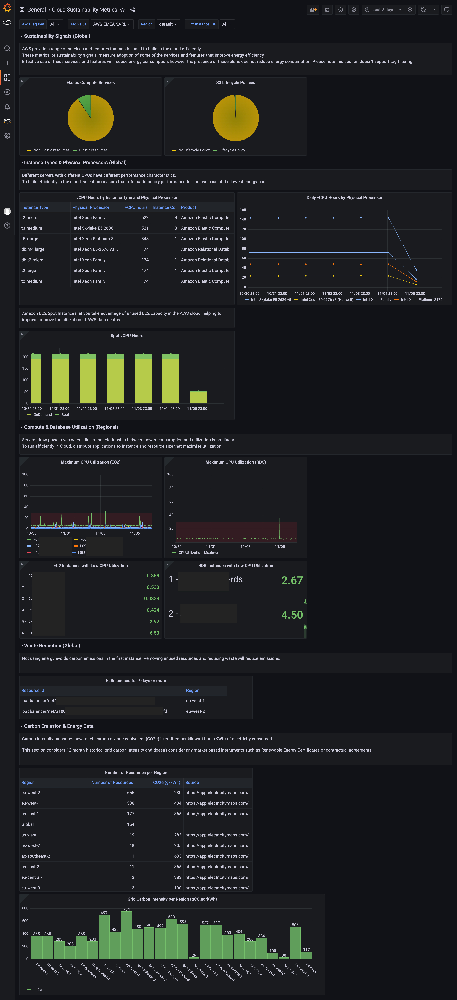

# Cloud Sustainability Dashboard

## Overview

The Sustainability Metrics Dashboard provides visibility into key metrics for building sustainably in the cloud. The
dashboard shows resource level data of compute, network, storage and operational usage of your AWS environment to
support optimization decisions and reduce carbon footprint of cloud usage.

## Getting Started

To get started with the Sustainability Metrics Dashboard follow our [Deployment Guide](docs/deployment.md).

For development see the [Contributing Guide](CONTRIBUTING.md).

For a reference on methodology used for current visualisations available on the bundled dashboard configuration, please
read the [Methodology](docs/methodology.md) document.

## Licence

[Apache 2.0](LICENSE)
