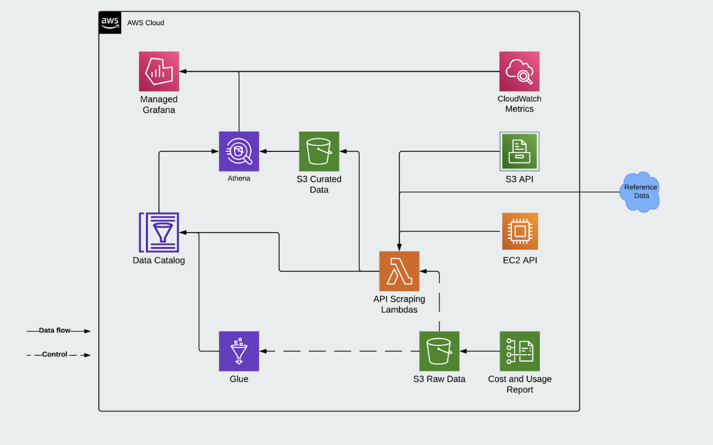

# Deployment Guide

## Architecture


A number of Checkov security policy checks are skipped or disabled through annotations. These should be re-evaluated for your specific organisational policies and cloud environment.

## Cost
:warning: Amazon Managed Grafana [pricing](https://aws.amazon.com/grafana/pricing/) is per user licence, per workspace, per month. **Destroying and recreating workspaces, users or api keys you will incur significant costs due to monthly minimums for each licence, even if transient.**

### Core Infrastructure
Amazon Managed Grafana - [pricing](https://aws.amazon.com/grafana/pricing/)
- An Amazon Managed Grafana Editor license or API user license costs $9 per active editor or administrator user per workspace per month. API user editor
- Amazon Managed Grafana Viewer license costs $5 per active user per workspace per month
- An Amazon Managed Grafana API user license with Administrator or Editor permissions is billed at $9 per active API user or $5 per active API user for an API user license with Viewer permissions. 

Most other AWS resources are covered by infracost. See pricing below but please note usage details are not included in cost as will vary based on environment.

<details>
<summary><strong>Infracost output</strong></summary>

```
Project: cloud-sustainability-dashboard/terraform

+ aws_s3_bucket.grafana
  Monthly cost depends on usage

    + Standard
    
        + Storage
          Monthly cost depends on usage
            +$0.024 per GB
    
        + PUT, COPY, POST, LIST requests
          Monthly cost depends on usage
            +$0.0053 per 1k requests
    
        + GET, SELECT, and all other requests
          Monthly cost depends on usage
            +$0.00042 per 1k requests
    
        + Select data scanned
          Monthly cost depends on usage
            +$0.00225 per GB
    
        + Select data returned
          Monthly cost depends on usage
            +$0.0008 per GB

+ module.CUR_stack.aws_glue_catalog_database.aws_glue_catalog_database
  Monthly cost depends on usage

    + Storage
      Monthly cost depends on usage
        +$1.00 per 100k objects

    + Requests
      Monthly cost depends on usage
        +$1.00 per 1M requests

+ module.CUR_stack.aws_glue_crawler.this
  Monthly cost depends on usage

    + Duration
      Monthly cost depends on usage
        +$0.44 per hours

+ module.CUR_stack.aws_kms_key.key[0]
  +$1.00

    + Customer master key
      +$1.00

    + Requests
      Monthly cost depends on usage
        +$0.03 per 10k requests

    + ECC GenerateDataKeyPair requests
      Monthly cost depends on usage
        +$0.10 per 10k requests

    + RSA GenerateDataKeyPair requests
      Monthly cost depends on usage
        +$0.10 per 10k requests

+ module.CUR_stack.aws_lambda_function.cur_crawler_notifier
  Monthly cost depends on usage

    + Requests
      Monthly cost depends on usage
        +$0.20 per 1M requests

    + Duration
      Monthly cost depends on usage
        +$0.0000133334 per GB-seconds

+ module.CUR_stack.aws_s3_bucket.bucket[0]
  Monthly cost depends on usage

    + Standard
    
        + Storage
          Monthly cost depends on usage
            +$0.024 per GB
    
        + PUT, COPY, POST, LIST requests
          Monthly cost depends on usage
            +$0.0053 per 1k requests
    
        + GET, SELECT, and all other requests
          Monthly cost depends on usage
            +$0.00042 per 1k requests
    
        + Select data scanned
          Monthly cost depends on usage
            +$0.00225 per GB
    
        + Select data returned
          Monthly cost depends on usage
            +$0.0008 per GB

+ module.cloudwatch_lambda_collector.aws_lambda_function.this
  Monthly cost depends on usage

    + Requests
      Monthly cost depends on usage
        +$0.20 per 1M requests

    + Duration
      Monthly cost depends on usage
        +$0.0000133334 per GB-seconds

+ module.ec2_lambda_collector.aws_lambda_function.this
  Monthly cost depends on usage

    + Requests
      Monthly cost depends on usage
        +$0.20 per 1M requests

    + Duration
      Monthly cost depends on usage
        +$0.0000133334 per GB-seconds

+ module.s3_lambda_collector.aws_lambda_function.this
  Monthly cost depends on usage

    + Requests
      Monthly cost depends on usage
        +$0.20 per 1M requests

    + Duration
      Monthly cost depends on usage
        +$0.0000133334 per GB-seconds

+ module.shared_storage.aws_glue_catalog_database.metrics
  Monthly cost depends on usage

    + Storage
      Monthly cost depends on usage
        +$1.00 per 100k objects

    + Requests
      Monthly cost depends on usage
        +$1.00 per 1M requests

+ module.shared_storage.aws_kms_key.this
  +$1.00

    + Customer master key
      +$1.00

    + Requests
      Monthly cost depends on usage
        +$0.03 per 10k requests

    + ECC GenerateDataKeyPair requests
      Monthly cost depends on usage
        +$0.10 per 10k requests

    + RSA GenerateDataKeyPair requests
      Monthly cost depends on usage
        +$0.10 per 10k requests

+ module.shared_storage.aws_s3_bucket.raw_data
  Monthly cost depends on usage

    + Standard
    
        + Storage
          Monthly cost depends on usage
            +$0.024 per GB
    
        + PUT, COPY, POST, LIST requests
          Monthly cost depends on usage
            +$0.0053 per 1k requests
    
        + GET, SELECT, and all other requests
          Monthly cost depends on usage
            +$0.00042 per 1k requests
    
        + Select data scanned
          Monthly cost depends on usage
            +$0.00225 per GB
    
        + Select data returned
          Monthly cost depends on usage
            +$0.0008 per GB

Monthly cost change for contino/cloud-sustainability-dashboard/terraform
Amount:  +$2.00 ($0.00 → $2.00)

──────────────────────────────────
Key: ~ changed, + added, - removed

48 cloud resources were detected:
∙ 12 were estimated, 10 of which include usage-based costs, see https://infracost.io/usage-file
∙ 28 were free:
  ∙ 6 x aws_glue_catalog_table
  ∙ 6 x aws_iam_role
  ∙ 4 x aws_lambda_permission
  ∙ 3 x aws_cloudwatch_event_rule
  ∙ 3 x aws_cloudwatch_event_target
  ∙ 3 x aws_s3_bucket_public_access_block
  ∙ 1 x aws_kms_alias
  ∙ 1 x aws_s3_bucket_notification
  ∙ 1 x aws_s3_bucket_policy
∙ 8 are not supported yet, see https://infracost.io/requested-resources:
  ∙ 3 x aws_s3_bucket_server_side_encryption_configuration
  ∙ 1 x aws_athena_workgroup
  ∙ 1 x aws_cur_report_definition
  ∙ 1 x aws_grafana_workspace
  ∙ 1 x aws_grafana_workspace_api_key
  ∙ 1 x aws_s3_object
```
</details>
<br />

### Dashboard Usage
The dashboard uses a range of services such as CloudWatch, Amazon Athena, S3, KMS and Data Transfer which are billed
based on usage and will change based on user behaviour and dashboard setup. An estimate is not provided for this.

Infrastructure and dashboard usage costs should be evaluated before deployment. We accept no responsibility for the
costs incurred whilst using this solution.

## Deployment Steps

### Part 1 - Deploy Infrastructure

Using the Terraform workspace of this code repository, ensure the create_managed_grafana variable is set to true and
apply the Terraform deployment as described on [Running Terraform](../CONTRIBUTING.md#running-terraform) on the
Contribution Guide.

### Part 2 - Grafana - Configure users

As previously described on [Core Infrastructure](#core-infrastructure), managed Grafana price model should be evaluated
before assigning users to the workspace:

1. On AWS Console, go to Amazon Grafana service and select the *cloud_sustainability_dashboard* workspace
2. Click on *Assign new user or group* under *AWS IAM Identity Center*
3. Find and assign an IAM principal to the workspace
4. Select the newly created user, click on Actions and choose the role to assign 

### Part 3 - Grafana - Setup datasources

Using the AWS datasource page (not the Grafana data sources page) configure the data sources:

5. Select Athena
6. Choose the required region
*  a) Select AWS CUR configuration - Database (sustainability-report) Workgroup(sustainability-metrics-dashboard)
*  b) Select Sustainability Metrics data configuration - Database (sustainability_metrics_dashboard_data) Workgroup (sustainability-metrics-dashboard)
7. Click Add data sources
8. Go to Settings, rename and change as appropriate, Save and Test

Using the AWS datasource page (not the Grafana data sources page) configure the data sources:

9. Select CloudWatch
10. Choose the required region
11. Go to Settings, rename and change as appropriate

### Part 4 - Grafana  Import Dashboard
12. Go to create menu (the + icon), click import
13. Select Upload JSON file
14. Upload [Sustainability Metrics Dashboard JSON](../terraform/grafana-dashboard.json)
15. Map data sources
    * AWS Athena eu-west-2 AwsDataCatalog (CUR) to the AWS CUR Configuration. (Data source was configured in Part 3, 6a)
    * AWS Athena eu-west-2 AwsDataCatalog (Data) yo yhe Sustainability Metrics Data Configuration. (Data source was
      configured in Part 3, 6b)
    * Amazon CloudWatch eu-west-2
* Click Import
